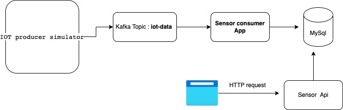

IOT Sensor event Consumer and API

The framework is broken down into 3 parts : A consumer, a rest api and a database.

Design Decisions
1. Isolated containers for consumer and rest api
      1. Allows for independent scaling of the consumer in case of increase in throughput on the kafka topic
      2. Allows us to spin up additional consumers in case of new use cases that can't be supported by the existing consumer
      3. Easier CI/CD when the two systems are isolated
      4. Tech stack of either can be swapped with no impact on the other
2. Mysql Database
      1. I chose this database as I felt that given the nature of the queries, a normalized database with strong indexing support would be the best option
      2. Given that we are recieving input from IOT sensors I felt that we should optimize for a high write throughput as well
            1. mysql has a battle tested choice for many high throughput scenarios in production, for eg. the initial messenger application at Facebook
      3. Although I chose a normalized database for this assignment, I also feel that an unstructured document database would be suitable for our needs. The reasons being :
            1. Unstructured nature of the database allows us to support new event schemas
            2. Supports indexing on fields (both first class and nested fields)
            3. In case event throughput drastically increases, Mongodb allows for simpler scaling and rebalancing of shards, ie. we do not need to worry about implementing logical shards





Procedure to run the Application
 ```shell

cd iot-consumer
mvn clean install
cd ../sensor-api
mvn clean install
cd ..
docker-compose -f "docker-compose.yml" up --build -d
```

This should build and start three containers
```shell
Starting mysql-standalone ... done
Starting iot-consumer   ... done
Starting sensor-api       ... done
```

Generate Sensor events using iot-producer-simulator-api below

[https://github.com/operations-relay42/iot-producer-simulator-api]()


Access the Sensor API using below cmds

Here the following fields are mandatory
- fromDate (mandatory)
- toDate (mandatory)
- eventType (optional)
- clusterId (optional)

```shell
curl --location --request POST 'http://localhost:8089/iot-sensor/fetch' \
--header 'Content-Type: application/json' \
--data-raw '
    {
        "fromDate": "2022-01-18T18:21:32Z",
        "toDate": "2022-01-18T18:21:32Z",
        "type": ["TEMPERATURE"]
        "clusterId": ["1"]
    }'
```

```shell
curl --location --request POST 'http://localhost:8089/iot-sensor/fetch/avg' \
--header 'Content-Type: application/json' \
--data-raw '
    {
        "fromDate": "2022-01-18T18:21:32Z",
        "toDate": "2022-01-18T18:21:32.77Z"
    }'

```

Similarly Min/Max/Avg/ of event value could be retrieved using the below API using the same body

These below APi's can be accessed
```shell

http://localhost:8089/iot-sensor/fetch/min

http://localhost:8089/iot-sensor/fetch/avg

http://localhost:8089/iot-sensor/fetch/max

```

The aggregate operation would generate result **value** along with the query fields

```json
{
        "fromDate": "2022-01-18T18:21:32",
        "toDate": "2022-01-19T18:21:32",
        "type": ["TEMPERATURE"],
        "clusterId": ["1"],
        "values" : 798.11
}
```

The fetch endpoint will return the sensor event details
```json
[
  {
        "id": 1,
        "sensorId": 1,
        "type": "LIGHT",
        "name": "Living Room Temp",
        "clusterId": 1,
        "timestamp": "2022-01-18T17:41:31Z",
        "value": 74.65
  },
  {
    "id": 2,
    "sensorId": 1,
    "type": "LIGHT",
    "name": "Living Room Temp",
    "clusterId": 1,
    "timestamp": "2022-01-18T17:41:37Z",
    "value": 74.61
  }
]
```

Data Model

All the sensor events from Kafka topic `iot-data` are stored in Mysql in below structure:

| Field     | Type           | Description                          | 
|-----------|----------------|--------------------------------------|
| id        | Long           | Primary key                          | 
| value     | BigDecimal     | Sensor measured value                |
| timestamp | OffsetDateTime | Event timestamp                      | 
| eventType | String         | Sensor type                          | 
| name      | String         | Sensor name                          | 
| clusterId | Long           | Cluster of which this sensor belongs |
| sensorId  | Long           | Sensor Id                            |


Index is created on **timestamp** column to support fast filtering on time range.
